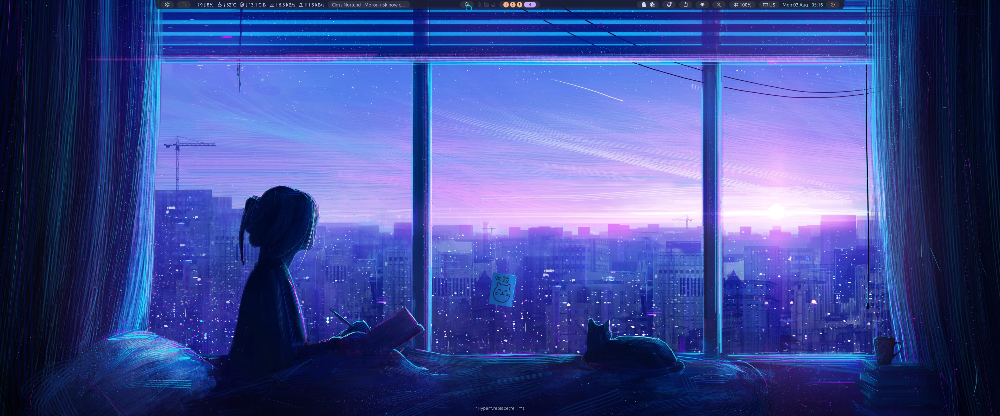
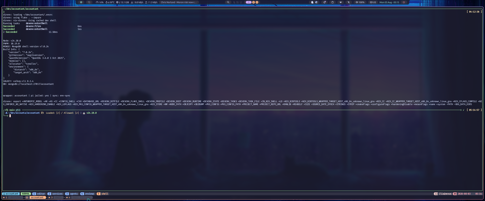
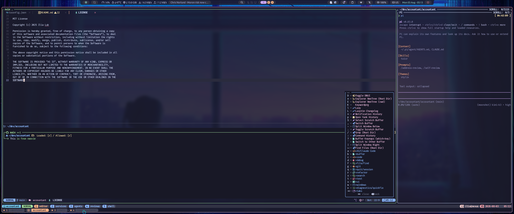
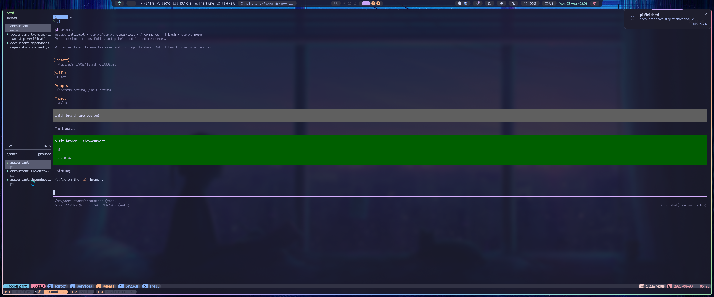
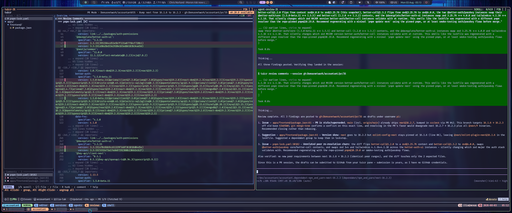

<h3 align="center">
 .dotfiles for the NixOS CLI ninja
</h3>

<p align="center">
  
</p>

A fully declarative NixOS development environment. One repo, one command, whole machine:

- **NixOS 26.05 + flakes + home-manager** — system and user config from a single source.
- **Stylix**-driven theming: `catppuccin-mocha` propagated to every tool from one palette definition — terminal, editor, bars, TUIs, even the AI agent's interface.
- **Hyprland** (+uwsm) with **noctalia** as bar/launcher/notifications.
- `kitty` + `nushell` + `starship` + `zellij` (with a stylix-themed `zjstatus` bar).
- `lazyvim` (config lives in-repo, plugin lockfile committed), `yazi`, `bat`, `lazygit`, `gh-dash`, `tuicr`.
- **sops-nix** secrets — API keys and credentials encrypted in-repo, decrypted per-user at runtime.
- A **bubblewrap-jailed AI coding agent** ([pi](https://pi.dev)) — sandboxed per project, with per-client toolchains.
- A **devenv wrapper system** for client projects: reproducible per-project environments, one-command project birth, self-updating ceremonies, multi-agent orchestration via **herdr** + **worktrunk**.

## Previews

<details>
<summary>🖥️ Desktop (Hyprland + noctalia)</summary>

</details>
<details>
<summary>🚀 dev-up — five-tab project session</summary>

</details>
<details>
<summary>🪄 Editor tab (LazyVim + jailed pi)</summary>

</details>
<details>
<summary>🐑 Herdr — parallel agents</summary>

</details>
<details>
<summary>📊 gh-dash + tuicr review</summary>

</details>

## The wrapper system

Client work happens in _project wrappers_: a thin, versioned directory holding the
dev environment, with the client's repo cloned into a gitignored subfolder — their
git history never sees my tooling.

```bash
cd ~/dev
wrapper-init acme git@github.com:acme/api.git   # scaffold + fill + git init + allow
cd acme && repo-clone                            # clone the client repo
dev-up                                           # themed zellij session: editor / services / agents / reviews / shell
```

Wrappers import their baseline **by reference** from this repo
(`devenv/wrapper-base.nix`) — ceremonies, the jailed agent composition, and all
improvements ship to every project via one command (`env-sync`), never by copying.
The scaffold itself is a flake template (`nix flake init -t ~/.dotfiles#wrapper`).

Ceremonies: `env-sync` · `repo-clone` · `dev-up` · `wrapper-doctor` (read-only
health check) · `herd`/`herd-status`/`herd-reset` (per-project agent sessions) ·
guarded `wt` (worktrees per branch/PR, inside the wrapper).

Full docs — including the tuicr × pi × gh-dash code-review workflows — live in the
[template README](devenv/templates/wrapper/README.md).

## The AI setup

[pi](https://pi.dev) runs **bubblewrap-jailed**, always:

- sees the current project (rw), its own config, and exactly the secrets and
  toolchain declared for it — nothing else;
- cannot see `$HOME`, SSH keys, or other clients' directories (sibling projects
  are _nonexistent_ in its filesystem);
- has no GitHub credentials by policy — remote operations stay human-side;
- per-project builds get the project's exact package set inside the jail.

Model: Kimi K3 (metered, via a custom provider). Reviews flow through
[tuicr](https://github.com/agavra/tuicr) sessions shared between the human TUI
and the agent's CLI. Rules the agents live by: [`user/app/pi/AGENTS.md`](user/app/pi/AGENTS.md).

## Layout

```
flake.nix            # inputs, nixosConfigurations, homeConfigurations, templates
profiles/personal/   # the machine: configuration.nix + home.nix
system/              # NixOS modules (wm, security, db, hardware, style, ...)
user/                # home-manager modules (app/, shell/, style/, wm/, security/)
user/app/nvim/       # LazyVim config (live working copy, lockfile committed)
user/app/pi/         # agent: base.nix (jail), models, prompts, AGENTS.md, theme
devenv/              # wrapper system: wrapper-base, scripts/, templates/, wrapper-init
themes/              # base16 schemes consumed by stylix
```

## Bootstrap

```bash
git clone git@github.com:ilia-luk/nixos-config.git ~/.dotfiles && cd ~/.dotfiles
# restore the sops age key to ~/.config/sops/age/keys.txt (from backup)
sudo nixos-rebuild switch --flake .#nexus
home-manager switch --flake .#ilia
```

## License

[MIT](LICENSE)
